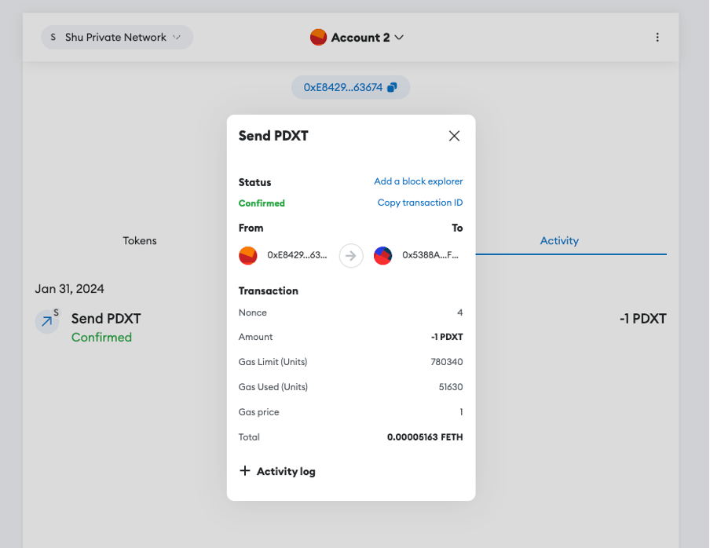

# Network Info

Chain ID: `888224`

RPC URL: `http://34.102.43.26:8545`

# Token Info

Token contract address: `0x11795E2bf7BBD20fE98eA458333AAc334F01a0dc`

### Geth Deployment Logs

Image below shows the Transaction Receipt for the Deployment of the ERC-20 PDXT.

### Metamask Token Balance

Image below shows the test ether balance denoted as FETH and 10 PDXT tokens.

### Transfer Token Image

Image below shows a success transfer of PDXT to another account.

### Geth Logs for Token Transfer

Image below shows the Transaction Receipt for the Transfer of PDXT

### Importing from another wallet

Image below shows the recipient perspective when importing the PDXT Token, showing the balance of PDXT that had been sent previously.

